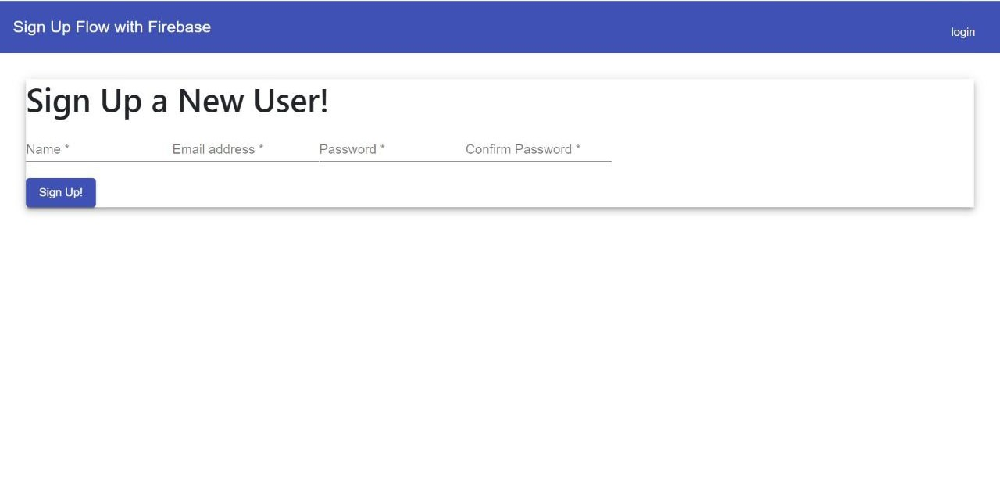
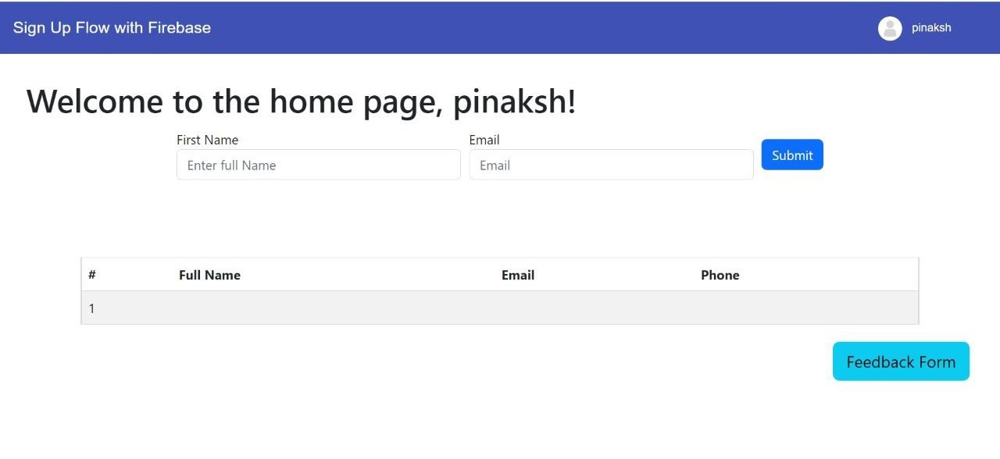
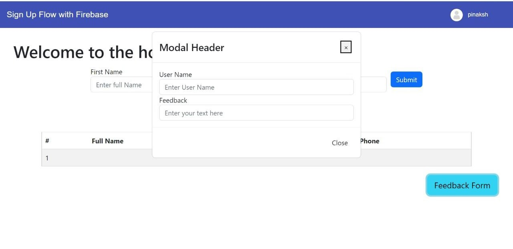

# HireHay
A recruitment tool so that potetntial employers can hunt, vet and discover new students as their potential new employee.

## Problem Statement
There is no concrete method for employers to check the students and their skillsets and systematically make hiring decisions.

## Proposed Solution
This project is basically a website that aims to bridge that gap between the students and the employers by acting as an intermediary, the employer will have access to the list of potential candidate and can make remarks or hire them using this platform.






## Angular application File / Folder Architecture summary:

1. ```package.json```: consists of Node/NPM library/package/module dependencies for application development
2. ```node_modues```: folder consists of all installed packages
3. ```src/main.ts```: entry point to angular application. src/index.html
4. ```app/app.module.ts```: route module of application
5. ```app/app.component.ts```: route component of application
6. ```ng serve / npm start```: main.ts (index.html) -> app.module.ts -> app.component.ts -> (app.component.html + css)

## Functionality & Concepts used :

The website has a very user friendly UI that can accessed by employers readily to make their hiring decsions. Following are few Web and Firebase concepts used to achieve the functionalities in website :
<br> 
<ul>
<li> Modules :To group the components, directives, pipes, and services, which are related to the application.</li>
<li> Components : to add header, footer, search feature in the website. Header and footer components are reused in the website. </li>
<li> Directives : Define how the view components are placed. It also describes the overall structure of the website components. </li>
<li> Databinding : Show the synchronisation between model and view. It populates the websites after mapping the model and view of each website page.
<li> Router :To handle the navigation from one view to the next.</li>
<li> Services : tells angular that the class is a service and can be injected into components that need that service.</li>
</li>
<li> Firebase Auth : To authenticate users to the website.</li>
<li> Firebase Hosting - To host the website.</li>
</ul>

## Application Link & Future Scope :

You can access the app using this link: https://hirehay.web.app.

We plan to scale this website and make a hub for student from all walks of life to come and present their skills to the market.

## Frontend

This project was generated with [Angular CLI](https://github.com/angular/angular-cli) version 14.0.0.